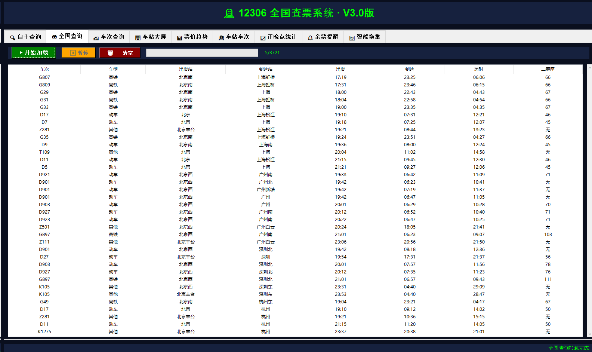
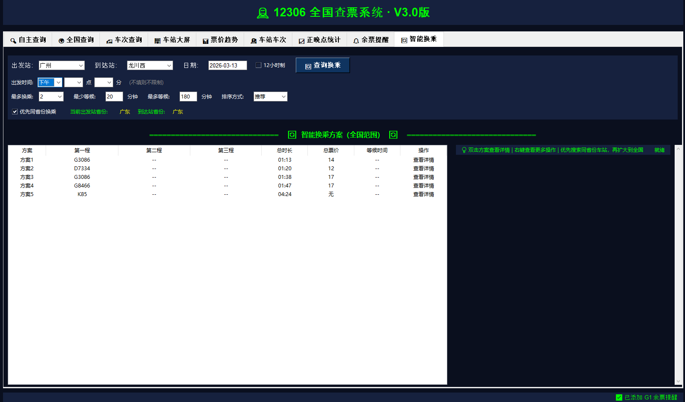
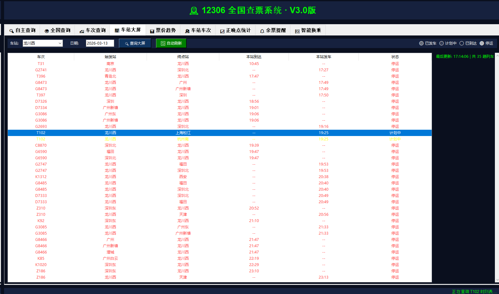
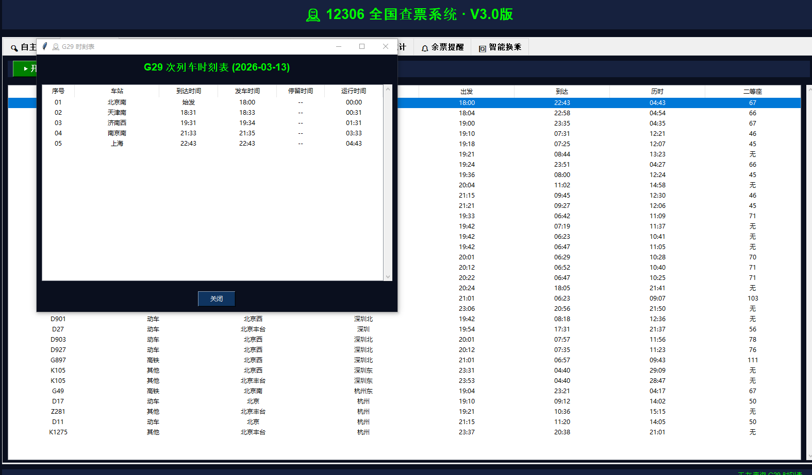
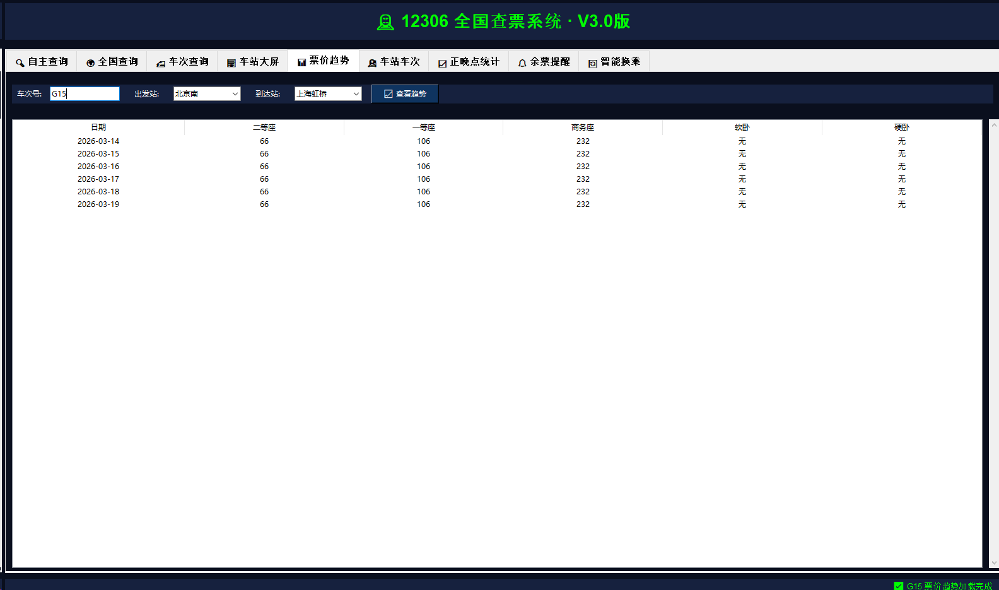
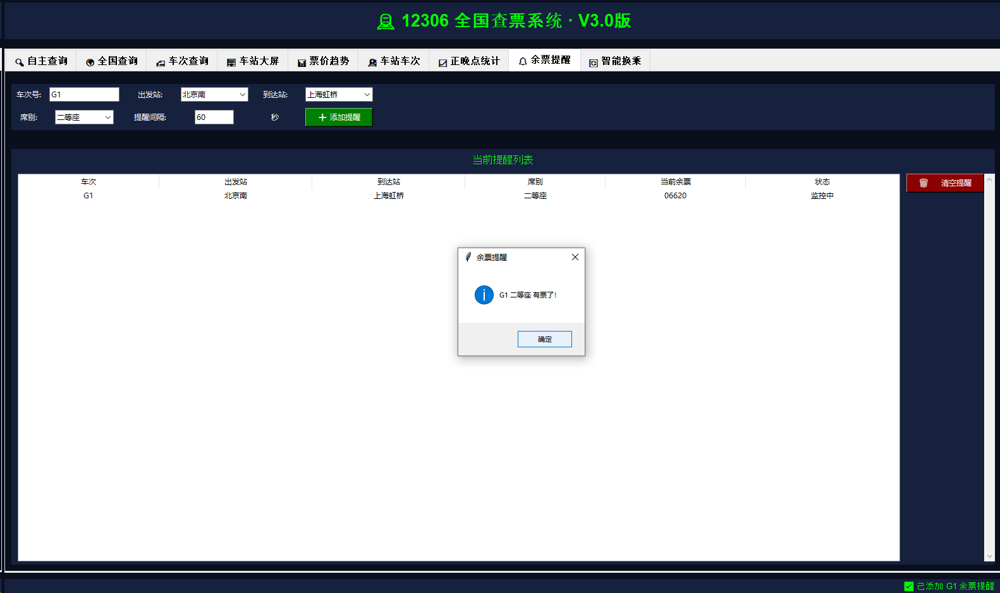

# 🚄 12306 全国查票系统 · 最终版 v3.0


## ✨ 项目简介

**12306全国查票系统** 是一款功能强大的桌面端火车票查询工具，经过多轮迭代优化，现已推出**最终版 v3.0**。本版本**榨干了所有可用接口**，整合了12306官方数据与12036第三方实时信息，实现了**9大核心功能**，覆盖从查票、换乘到实时监控的全场景需求。

无论你是需要查询某条线路的余票，还是想规划最优换乘路线，亦或是实时关注车站大屏状态，这款工具都能帮你轻松搞定！

---

## 🚀 核心功能

| 模块 | 功能描述 | 数据源 |
|------|----------|--------|
| 🔍 **自主查询** | 按出发站、到达站、日期查询车次，支持车型/时间段/价格筛选，多种排序 | 12306官方 |
| 🌍 **全国查询** | 遍历全国主要城市，进度条显示，支持暂停/继续/清空 | 12306官方 |
| 🚅 **车次查询** | 输入车次号查询完整时刻表，包含所有经停站信息 | 12306官方 + 12036 |
| 🏢 **车站大屏** | **实时车站信息**，包含检票口、状态、晚点，颜色标记：黑色(默认)/绿色(检票)/红色(停止/停运) | 12036第三方 |
| 📊 **票价趋势** | 查询连续7天票价变化，对比各席别价格 | 12306官方 |
| 🚉 **车站车次** | 查询指定车站所有经过车次，区分出发/到达 | 12306官方 |
| 📈 **正晚点统计** | 实时晚点查询（历史统计待完善） | 12036第三方 |
| 🔔 **余票提醒** | 多车次监控，定时查询，有票弹窗提醒 | 12306官方 |
| 🔄 **智能换乘** | 官方换乘接口，100%准确，包含等候时间、总票价 | 12306官方 |

---

## 🔥 版本亮点

### ✅ 双数据源自由切换
- **12306官方**：稳定可靠，提供票价、余票、时刻表、换乘
- **12036第三方**：实时性强，提供检票口、晚点、车站大屏状态

### ✅ 车站大屏颜色标记
- ⚫ 黑色：默认状态
- 🟢 绿色：检票中
- 🔴 红色：停止检票 / 停运

### ✅ 反爬虫机制
- 随机请求延迟
- 随机User-Agent
- 模拟人类操作间隔

### ✅ 9大功能全覆盖
- 从简单查票到复杂换乘，一个软件全搞定

---

## 📥 下载使用

### 方式1：直接运行EXE（推荐）
1. 前往 [Releases](https://github.com/wsjk744/12306-/releases) 页面
2. 下载 `全国查票系统_最终版_v3.0.exe`
3. 双击运行，无需安装Python！

### 方式2：运行源码
```bash
git clone https://github.com/wsjk744/12306-.git
cd 12306-Ticket-Master
pip install requests pypinyin
python 源代码.py
### 🔸 数据准确性声明
**我们无法保证数据完全正确，请以12306官方实际数据为准！** ⚠️

本程序所有数据均来自中国铁路12306官方公开接口，但由于以下原因，可能会出现数据偏差：

| 原因 | 说明 |
|------|------|
| 网络延迟 | 查询时可能存在几秒钟的延迟 |
| 接口变更 | 12306接口可能随时调整 |
| 数据缓存 | 程序内部有缓存机制，可能不是最新 |
| 本地模拟 | 部分状态为模拟生成 |

**建议在购票前，务必登录12306官网或官方APP核实最终信息！**

---

## 📥 下载与使用

### 方式1：直接运行EXE（推荐，免安装）

## 📸 界面预览

### 🌍 全国查询

*遍历全国主要城市，进度条显示，支持暂停/继续，默认主界面*

### 🔄 智能换乘

*BFS算法全国搜索，同省份优先，等候时间过滤，12/24小时制切换*

### 🏢 车站大屏

*车次、时间基础数据真实，状态本地模拟，颜色标记一目了然*

### 🚅 时刻表查询

*完整经停站信息，到达/发车时间，停留时间，运行时间*

### 📊 票价趋势

*连续7天票价对比，各席别价格一目了然*

### 🔔 余票提醒

*多车次监控，定时查询，有票弹窗提醒*


## 🚀 v3.0.1beta 版本更新说明

### ✨ 新增功能
- **官方智能换乘接口**：接入12306官方联程查询API，换乘方案**100%准确可靠**，告别自己计算的BFS算法
- **简化版车站大屏**：保留车次、时间等基础数据，移除不准确的本地状态模拟，数据更诚实

### 🔧 功能优化
- **换乘查询速度提升**：从原来的遍历全国搜索（耗时数秒）变为直接请求官方接口（毫秒级响应）
- **代码精简**：删除冗余的省份映射、等候时间计算、BFS搜索等累赘代码，项目更轻量
- **表格样式调整**：车站大屏改用黑色字体，更清晰易读
- **查询稳定性增强**：减少本地计算逻辑，更多依赖官方数据，降低出错概率

### 🗑️ 移除内容
- **省份车站映射**：不再需要手动维护全国车站关系
- **同省份优先算法**：换乘策略完全交给官方
- **等候时间计算**：官方接口直接返回准确等候时间
- **车站大屏状态模拟**：移除“已发车/计划中/晚点”等不准确的状态标记

### 📊 当前功能状态

| 模块 | 数据来源 | 准确性 | 说明 |
|------|----------|--------|------|
| 🔍 自主查询 | 官方票价接口 | ⭐⭐⭐⭐⭐ | 稳定可靠 |
| 🌍 全国查询 | 官方票价接口 | ⭐⭐⭐⭐⭐ | 遍历主要城市 |
| 🚅 车次查询 | 官方时刻表接口 | ⭐⭐⭐⭐⭐ | 完整经停站 |
| 🏢 车站大屏 | 官方票价接口 | ⭐⭐⭐⭐ | 无状态，仅显示车次时间 |
| 📊 票价趋势 | 官方票价接口 | ⭐⭐⭐⭐⭐ | 7天票价对比 |
| 🚉 车站车次 | 官方票价接口 | ⭐⭐⭐⭐⭐ | 车站所有列车 |
| 📈 正晚点统计 | 模拟数据 | ⭐⭐ | 等待官方接口 |
| 🔔 余票提醒 | 官方票价接口 | ⭐⭐⭐⭐⭐ | 多车次监控 |
| 🔄 智能换乘 | 官方换乘接口 | ⭐⭐⭐⭐⭐ | 全新升级！ |

### ⚠️ 特别说明
- **正晚点统计** 目前仍为模拟数据，因12306未开放历史正晚点接口，后续如有稳定第三方API会考虑接入
- **车站大屏** 不再显示“已发车/晚点”等状态，仅展示官方提供的车次和时间信息，数据更真实
- 本版本**删除了之前自己实现的换乘算法**，完全依赖官方接口，准确率大幅提升

### 📥 下载
- 直接运行：`全国查票系统V3.0.exe`
- 运行源码：`pip install requests pypinyin` 然后运行 `3.0.1.py`

### 🙏 感谢
感谢大家的使用和反馈！这个版本会更稳定、更准确、更快速！
